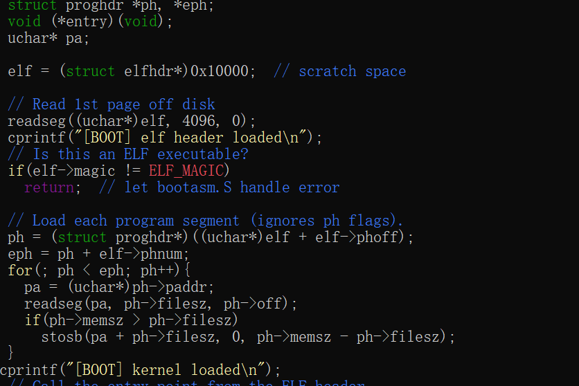
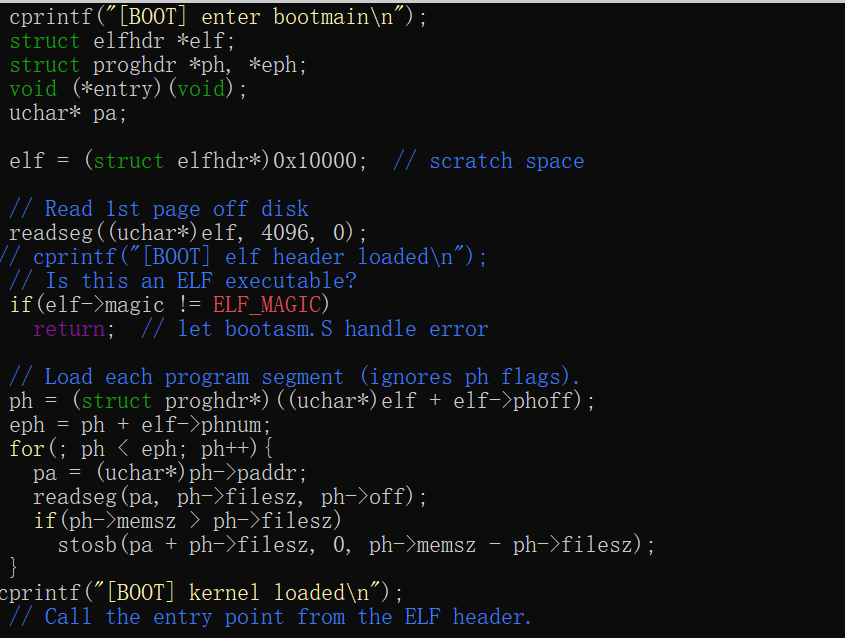
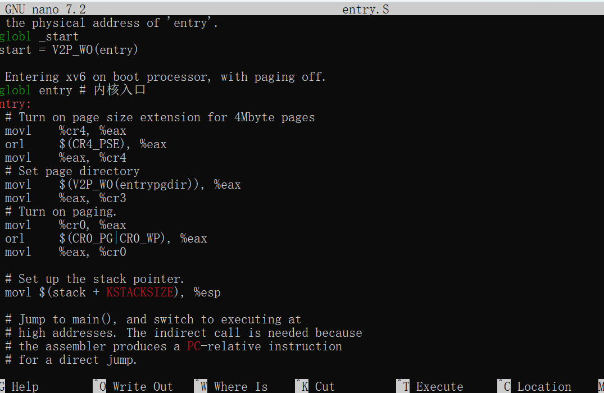
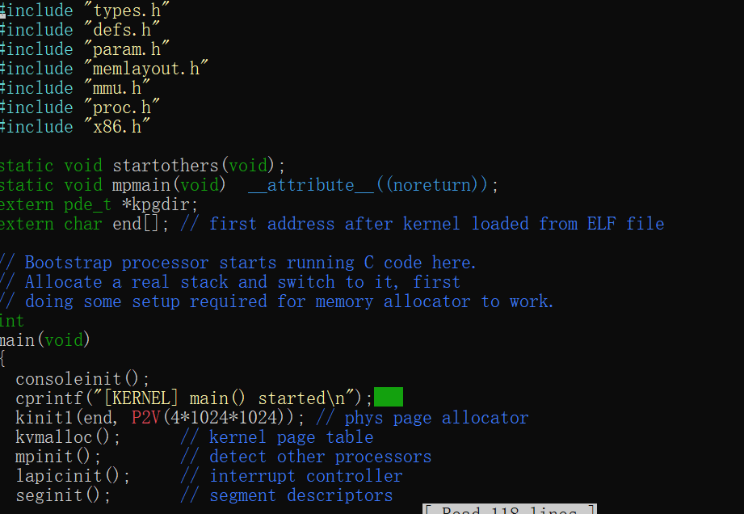

# xv6 启动流程实践

## 启动流程说明
1. bootblock → bootasm.S → bootmain.c → entry.S → main()
2. 启动阶段注释已在 bootasm.S、bootmain.c、entry.S 中添加
3. bootmain.c 中打印了启动阶段信息：
   - [BOOT] enter bootmain
   - [BOOT] elf header loaded
   - [BOOT] kernel loaded
4. entry.S 标记了内核入口
5. main.c 打印了 [KERNEL] main() started

## 运行结果
系统能正常启动，QEMU 中显示启动流程信息

## 个人总结
- 理解了汇编和 C 在启动阶段的协作方式
- 掌握了 xv6 启动链路和 ELF 内核加载过程
- 学会了在关键节点插入调试信息






# xv6 内核运行机制实践

## 一、实验内容说明

本次实践基于 MIT xv6（x86 版本），完成了以下分层任务：

### 第一层
- **任务1：系统调用路径跟踪**  
  在 `echo.c`、`syscall.c`、`sysfile.c` 中添加调试输出，观察 `write` 系统调用从用户态到内核态的完整路径。  
  输出示例：`[KERNEL] enter syscall 16` → `[KERNEL] sys write unloaded`

- **任务2：调度过程观察**  
  在 `proc.c` 的 `scheduler()` 中添加 `[SCHED] switch to pid=...` 日志。观察到进程 `sh` 和 `ls` 交替运行，验证了操作系统的分时调度机制。

- **任务3：内存分配观察**  
  在 `kalloc.c` 中添加 `[MEM] alloc page at 0x...` 日志。观察发现分配地址从高到低递减，说明 xv6 使用空闲链表管理物理内存，且分配是连续的。

### 第二层
- **任务1：新增系统调用 `hello()`**  
  实现了一个返回固定字符串的内核系统调用，系统调用号为 22。在 `syscall.h` 中定义、`syscall.c` 中注册、`sysproc.c` 中实现，并在用户程序 `hello_test` 中验证成功。

- **任务2：修改系统调用行为**  
  在 `sys_write` 中添加 `[PID=x]` 前缀，使得每次写操作都带上进程 PID。执行 `echo hello` 时输出 `[PID=3] [USER] calling write` 等前缀信息。

- **任务3：同步机制实验**  
  编写 `race.c` 程序，创建父子两个进程同时写终端。不加锁时 `child` 和 `parent` 输出严重交错；给 `write` 加自旋锁后，输出立即变得整齐有序，验证了锁对临界区的保护作用。

### 第三层
- **生产者-消费者模型**  
  在内核中实现共享缓冲区（`sync.c`），使用自旋锁 + `sleep/wakeup` 实现阻塞同步。提供了 `producer.c` 和 `consumer.c` 两个测试程序，缓冲区满时生产者睡眠、消费者取走数据后唤醒，验证了同步机制的正确性。

---

## 二、实现过程
### 实现步骤

1. 在 `syscall.h` 中定义系统调用号：`#define SYS_hello 22`
2. 在 `syscall.c` 中添加外部声明和函数表项：`extern int sys_hello(void);` 和 `[SYS_hello] sys_hello,`
3. 在 `sysproc.c` 中实现内核函数：
   ```c
   int sys_hello(void) {
     cprintf("Hello from kernel!\n");
     return 0;
   }
在 usys.S 中添加汇编入口：SYSCALL(hello)

在 user.h 中声明用户态函数：int hello(void);

编写测试程序 hello_test.c，调用 hello() 系统调用

在 Makefile 的 UPROGS 中添加 _hello_test\

运行结果
在 xv6 中执行 hello_test，成功输出：

text
Calling hello syscall...
[KERNEL] enter syscall 22
Hello from kernel!
Done.
三、遇到的问题及解决方法
QEMU 启动 panic: unknown apicid
新版 QEMU 与 xv6 的 APIC 初始化冲突。通过注释 proc.c 中的 panic("unknown apicid\n") 并让 mycpu() 返回 &cpus[0] 解决。

make qemu 报 -no-apic: invalid option
修改 Makefile 中 QEMUOPTS，移除 -no-apic，改为 -smp 1 -M pc 以兼容新版 QEMU。

用户态 user 目录丢失
通过 git clone 临时仓库恢复：cp -r /tmp/xv6-temp/user ~/xv6-practice/。

编译时 SYS_hello 未定义
检查发现 syscall.h 中忘记添加宏定义，添加 #define SYS_hello 22 并 make clean 后重新编译通过。

Makefile 添加新用户程序后语法错误
在 UPROGS 中添加 _producer\ 和 _consumer\ 时的缩进格式不一致导致。修改为与上下文一致的空格缩进后解决。

Git 推送时认证失败
GitHub 不再支持密码认证。通过创建 Personal Access Token 并用于代替密码解决。

四、实践心得
这次 xv6 内核实践让我第一次真正"走进"了操作系统内核的内部。以前在课堂上学习系统调用、进程调度、同步机制等概念时，总觉得比较抽象，而这次通过亲手修改代码、添加调试输出、观察运行结果，这些概念变得非常具体。

在系统调用路径跟踪实验中，我清楚地看到了一个 write 操作从用户程序开始，经过 usys.S 汇编入口进入内核，再由 syscall.c 分发到 sys_write 实现的完整过程。这让我深刻理解了用户态与内核态的边界，以及操作系统如何通过中断向量表实现权限切换。

进程调度观察让我看到了操作系统的"心跳"。[SCHED] switch to pid=... 的日志不断打印，让我直观感受到调度器在不停地在不同进程之间切换。同一个 sh 进程多次连续运行的现象也让我明白了调度算法并不总是严格轮转的。

同步机制的实验则是一个令人印象深刻的反面教材。不加锁时，两个进程的输出完全混乱，甚至一行文字被拦腰截断。而加了自旋锁之后，输出立刻变得整洁有序。这种对比让我真正认识到并发编程中竞态条件的危害，以及同步机制的重要性。

最让我有成就感的是生产者-消费者模型的实现。从内核缓冲区的设计、自旋锁的加锁解锁、sleep/wakeup 的配合使用，到最终两个进程协同工作，整个过程让我对操作系统的同步原语有了完整的实践认知。特别是 sleep/wakeup 代替忙等，让我理解了为什么操作系统要提供阻塞机制——它不仅保证了正确性，还避免了空转浪费 CPU 时间。

这次实践也让我学会了使用 Git 进行版本管理，体会到了"小步提交"的好处——每完成一个任务就提交一次，方便回顾和回退。同时在解决 QEMU 兼容性问题、Makefile 语法错误等过程中，也锻炼了我排查问题的能力。

总的来说，这次实验让我对操作系统不再停留在书本知识层面，而是有了实实在在的动手经验。
